# overview 

The dataset contains **1,465 Amazon product entries** with **16 columns** capturing product information, pricing details, discount patterns, ratings, reviews, and category classifications. It includes categorical fields (product names, categories, user and review identifiers), numerical variables (actual price, discounted price, discount percentage, rating, rating count), and text-based descriptions for reviews and product details.

Most columns are fully complete, but a few contain minor missingness, such as `rating_count` with ~2 missing entries. Price-related values initially appear as formatted strings (currency symbols, commas) and require cleaning before analysis. Discount information is stored as percentages and converted into numeric proportions for accurate computation.

The dataset is well suited for analyzing **pricing behavior, category-level performance, customer satisfaction patterns, discount strategies, and rating dynamics**. It supports a wide range of statistical techniques including correlation analysis, ANOVA, and significance testing. After cleaning and transformation, the dataset provides a strong foundation for generating **business insights, consumer behavior patterns, and product performance comparisons** across categories.


# The Questions based on section


## Section 1

### Product & Price Insights

1. What are the most common **product categories**?
2. What is the **average discounted price** and **average discount percentage** per category?
3. Which **categories** have the **highest** and **lowest** ratings on average?
4. What is the **distribution of product ratings** (1–5 stars)?
5. What percentage of products have a **rating count above the overall mean**?


### Review Insights

6. Who are the **top reviewers** (users with the most reviews)?
7. What are the **most frequent words** in review titles or review content? (Text analysis)
8. Is there a noticeable trend in **review ratings** vs. **review length** (longer reviews = higher/lower ratings)?


## Section 2

### Price & Discount Relationships

9. Is there a **significant difference** between the average **discounted price** and **actual price** across product categories?
    → (*t-test or ANOVA*)

10. Does the **number of reviews (rating_count)** affect the **average rating**?
    → (*Correlation or regression*)

11. Is there a **significant difference** in average **ratings** between **top 3 product categories**?
    → (*ANOVA test*)


## Section 3

### Business-Oriented Questions

12. Which types of products generate **the best customer satisfaction** (high ratings and high discounts)?
13. Are there specific **categories** where discounts have **no effect** on customer satisfaction?
14. Is there a **correlation** between **discount percentage** and **rating**?
    → (*Correlation analysis or regression*)
15. Do **higher discounts** lead to **higher customer ratings**?
    → (*Hypothesis testing: H₀ = no relationship*)


Here is a clean, polished, consistent **Tools Used** section written in the same style as your example, but tailored to your **Amazon Sales Analysis Project**:


# **Tools I Used**

* **Python** — the primary tool for cleaning, transforming, analyzing, and visualizing the dataset.

  * **Pandas** — used for data manipulation, cleaning, and exploratory analysis.
  * **NumPy** — used for numerical operations and statistical calculations.
  * **Matplotlib** — used to create foundational visualizations and custom plots.
  * **Seaborn** — used to enhance visuals with more advanced and aesthetically pleasing charts.
  * **SciPy** — used to run statistical tests such as t-tests, ANOVA, correlation analysis, and significance testing.
  * **Statsmodels** — used for pairwise comparisons (Tukey HSD), model-based analysis, and advanced statistical inference.

* **Jupyter Notebook** — the main environment for running, documenting, and visualizing code step-by-step.

* **VS Code** — my preferred editor for writing and organizing Python scripts more efficiently.

* **Git & GitHub** — essential for version control, sharing the project, and ensuring smooth collaboration and reproducibility.


# Data preparation and clean up 

 - Import data and clean up
   - Here I have cleand and filterd my data 

### Cleanup:

```
df['actual_price'] = (df['actual_price'].str.replace('₹', '', regex=False).str.replace(',', '', regex=False))
df['discounted_price'] = (df['discounted_price'].str.replace('₹', '', regex=False).str.replace(',', '', regex=False))
df['discount_percentage'] = (df['discount_percentage'].str.replace('%', '', regex=False).str.replace(',', '', regex=False))
df['rating_count'] = (df['rating_count'].str.replace(',', '', regex=False))
df['rating'] = (df['rating'].str.replace('|', '0', regex=False))


df['actual_price']= df['actual_price'].astype(float)
df['discounted_price']= df['discounted_price'].astype(float)
df['discount_percentage']= df['discount_percentage'].astype(float)
df['rating_count']= df['rating_count'].astype(float)
df['rating']= df['rating'].astype(float)

# turn discount_percentage to float percentage
df['discount_percentage']= df['discount_percentage'].apply(lambda x: x/100)

# make the discounted_price more accurate
df['discounted_price'] = (df['actual_price'] * (1 - df['discount_percentage']))

# make a cleaned category column
df['category_clean']= df['category'].apply(lambda x: x.split('|')[-1]).copy()
```

# The Analysis


## 1. What are the most common **product categories**?

The analysis aimed to identify the most common product categories in the dataset by examining the frequency of listings for each category. The dataset was first cleaned to remove any missing or inconsistent category entries. Next, the data was grouped by the **category** field, and the total count of products in each category was calculated. After sorting the categories in descending order based on product counts, the top categories were selected for visualization.

A horizontal bar chart was created using Seaborn to display the results, showing categories such as **USBCables, SmartWatches, Smartphones, Smartphones, and SmartTelevisions....** as the most frequent. Each bar represented the total number of products per category, with labels showing the exact counts for clarity. This visualization allowed for a clear comparison, highlighting which product categories dominate the dataset and are most represented among the listings.


View my notebook in details here:
[1_Categories_Analysis.ipynb](1_Product_&_Price_Insights/1_Categories_Analysis.ipynb)

### Visualize data 

```
sns.set_theme(style="whitegrid")

sns.barplot(data=df_top10_categories, y='category_clean', x='count', palette='mako')

for i, value in enumerate(df_top10_categories['count']):
    plt.text(value + 3, i, f'{int(value)}')

plt.title("Top 10 Product Categories")
plt.xlabel("Count")
plt.ylabel("Category")
plt.tight_layout()
plt.show()

sns.despine()
```

### Results
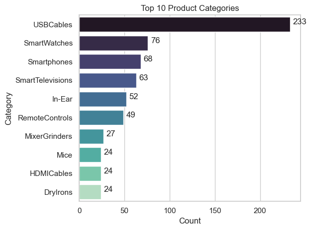


### Insights

The bar chart displays the **Top 10 product categories** by number of items in the dataset. The distribution shows a clear dominance of tech accessories, especially charging and connectivity products.

* **USBCables** lead by a large margin with **233 products**, indicating high variety and demand in everyday device accessories.
* **SmartWatches (76)** and **Smartphones (68)** follow, reflecting strong consumer interest in modern smart devices.
* **SmartTelevisions (63)** and **In-Ear devices (52)** also appear prominently, showing consistent demand for home entertainment and audio products.
* The remaining categories, such as **RemoteControls**, **MixerGrinders**, **Mice**, **HDMICables**, and **DryIrons**, each contribute between **24–49** products, representing stable but smaller markets.


## 2. What is the **average discounted price** and **average discount percentage** per category?

The analysis focused on understanding how discounts varied across different product categories by calculating both the **average discounted price** and the **average discount percentage**. The dataset was first grouped by **Category**, and then the mean of the discounted prices and discount percentages was computed for each group.

The results showed that **Smart Televisions** had the **highest average discounted price of $24,851.79** with an **average discount of 38.29%**, reflecting substantial markdowns on high-value items. In contrast, **Smartphones** had a **lower average discounted price of $15,757.61** with a **smaller average discount of 23.25%**, indicating relatively smaller reductions compared to televisions.

View my notebook in details here:
[1_Categories_Analysis.ipynb](1_Product_&_Price_Insights/1_Categories_Analysis.ipynb)


### Visualize data 

```
sns.set_theme(style="whitegrid")

mean_rating= df_concat['rating'].mean()

sns.scatterplot(data=df_concat, x='rating', y='discounted_price', hue='category_clean')
plt.axvline(x=mean_rating, color='red', linestyle='--', label='Mean Rating')

sns.despine()
plt.title('Product Ratings vs Average Discounted Price')
plt.xlabel('Average Rating')
plt.ylabel('Discounted Price')
plt.legend()
plt.show()
```


### Results
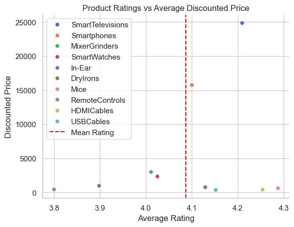


### Insights

* **Observation:** There is no strong linear correlation between **average rating** and **discounted price**. The mean rating line (around 4.1) shows that high-priced products like **SmartTelevisions** and **Smartphones** are above average in rating, while cheaper products such as **USBCables** and **HDMICables** also exceed the mean rating.

* **Interpretation:** High ratings are not exclusively tied to expensive products; smaller, cheaper items can achieve high customer satisfaction. This suggests that value perception and quality matter across the price spectrum, not just in premium products.


## 3. Which **categories** have the **highest** and **lowest** ratings on average?

The analysis aimed to determine which product categories received the highest and lowest average customer ratings. The dataset was grouped by **Category**, and the **mean rating** for each category was calculated. This allowed for a direct comparison across all categories to identify consumer preferences and satisfaction levels.

After sorting the results by average rating, the category **Smart Televisions** emerged with the **highest average rating of 4.21**, indicating strong customer satisfaction. On the other hand, **Smartphones** had the **lowest average rating of 4.10**, suggesting comparatively lower user approval.


View my notebook in details here:
[1_Categories_Analysis.ipynb](1_Product_&_Price_Insights/1_Categories_Analysis.ipynb)


### Visualize data 

```
df_concat= df_concat.groupby('category_clean').agg({'discounted_price' : 'mean'
                                         ,'discount_percentage' : 'mean'
                                         ,'rating' : 'mean'}).sort_values(by= 'discounted_price', ascending= False)
df_concat
```


### Results

| Category            | Average Discounted Price ($) | Average Discount Percentage | Average Rating |
|--------------------|-----------------------------|----------------------------|----------------|
| SmartTelevisions    | 24,851.79                   | 38.29%                     | 4.21           |
| Smartphones        | 15,757.61                   | 23.25%                     | 4.10           |
| MixerGrinders      | 3,004.80                    | 43.96%                     | 4.01           |
| SmartWatches       | 2,344.34                    | 69.82%                     | 4.03           |
| In-Ear             | 975.19                      | 58.27%                     | 3.98           |
| DryIrons           | 762.69                      | 34.25%                     | 4.13           |
| Mice               | 610.01                      | 42.04%                     | 4.29           |
| RemoteControls     | 430.87                      | 59.51%                     | 3.80           |
| HDMICables         | 405.99                      | 59.79%                     | 4.25           |
| USBCables          | 360.60                      | 59.38%                     | 4.15           |


### Insights

* **Observation:** Products with the highest discounts are not necessarily the highest-rated or most expensive. For example, **SmartWatches** and **USBCables** have some of the highest average discount percentages (69.82% and 59.38%), but their average ratings are moderate (4.03 and 4.15). Conversely, **Mice** and **HDMICables** have slightly lower discounted prices but higher ratings (4.29 and 4.25).

* **Interpretation:** Customers may value quality (rating) over price in some categories, especially for tech accessories like **Mice** and **HDMICables**, while products like **SmartWatches** rely more on discounting to attract buyers.


## 4. What is the **distribution of product ratings** (1–5 stars)?

The analysis examined how customer ratings were distributed across all products to understand overall satisfaction levels and identify any patterns in rating behavior. The dataset was processed by extracting all rating values, then calculating key statistical measures such as the **mean**, **median**, and **quartiles**. These metrics helped summarize how tightly ratings were clustered and whether any skewness existed in the distribution.

A combined visualization using a **histogram with a KDE curve** and a **boxplot** was created to illustrate the distribution. The histogram revealed that most ratings fall within a narrow, high range between **4.0 and 4.3**, indicating consistently positive feedback across products. The boxplot confirmed this by showing a very compact interquartile range, with **Q1 at 4.0**, **median at 4.1**, and **Q3 at 4.3**. Only a small number of outliers appeared below 3.5 or near 5.0, suggesting that very low or extremely high ratings are uncommon.

Overall, the visualization demonstrates that product ratings are **highly concentrated around 4+ stars**, reflecting strong and stable customer satisfaction across the entire dataset. This consistent pattern provides valuable insights for evaluating product quality and consumer perception.

View my notebook in details here:
[2_Rating_Analysis.ipynb](1_Product_&_Price_Insights/2_Rating_Analysis.ipynb)


### Visualize data

```
sns.set_theme(style="whitegrid")

fig, ax =plt.subplots(2, 1, figsize=(10, 8))

#----------------------------------------------------------------------#

sns.histplot(data=df_concat, x='rating', bins=20, kde=True, ax=ax[0])
ax[0].set_ylabel('Count of products have been rated')
ax[0].set_xlabel('Rating')

#----------------------------------------------------------------------#

sns.boxenplot(data=df_concat, x='rating', ax=ax[1])
ax[1].set_xlabel('Rating')
ax[1].set_ylabel('Boxplot for the products` rating')

#----------------------------------------------------------------------#

fig.suptitle('Distribution of product ratings', fontsize=16, weight='bold', y=0.98)

#----------------------------------------------------------------------#

ax[0].axvline(x=mean_rating, color='red', linestyle='--', label='Mean Rating: 4.0915625')
ax[1].axvline(x=mean_rating, color='red', linestyle='--', label='Mean Rating: 4.0915625')
ax[0].axvline(x=q1, color='#FFF44F', linestyle='--', label='Q1 (25th percentile): 4.0')
ax[1].axvline(x=q1, color='#FFF44F', linestyle='--', label='Q1 (25th percentile): 4.0')
ax[0].axvline(x=q2, color='#2ca02c', linestyle='--', label='Q2 (50th percentile / median): 4.1')
ax[1].axvline(x=q2, color='#2ca02c', linestyle='--', label='Q2 (50th percentile / median): 4.1')
ax[0].axvline(x=q3, color='#FFF44F', linestyle='--', label='Q3 (75th percentile): 4.3')
ax[1].axvline(x=q3, color='#FFF44F', linestyle='--', label='Q3 (75th percentile): 4.3')

plt.legend()
sns.despine()
plt.tight_layout()
plt.show()
```


### Results
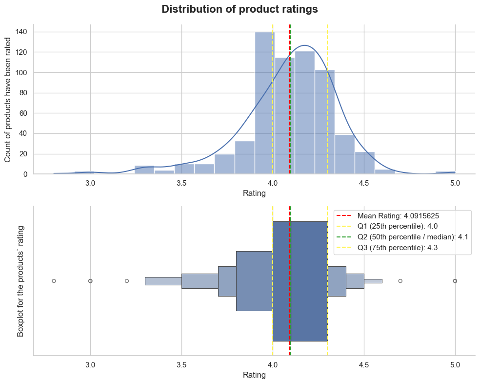


### Insights

The analysis examined how product ratings are distributed across all categories by looking at the **mean**, **quartiles**, and the **spread** of ratings. Both a histogram and a boxplot were used to clearly visualize the central tendency and variability.

### **Overall Rating Insights**

The ratings exhibit a **tight and strongly positive distribution**, indicating that most products receive good reviews from customers.

* **Mean Rating:** **4.09**
  This shows that, on average, products are rated just above 4 stars, reflecting strong overall satisfaction.

* **Q1 (25th percentile):** **4.0**
  A quarter of all products have ratings below 4.0, meaning the majority of items cluster at or above this threshold.

* **Median (Q2):** **4.1**
  Half of all products receive a rating of **4.1 or higher**, confirming that the distribution is slightly left-skewed.

* **Q3 (75th percentile):** **4.3**
  Three-fourths of the products are rated **4.3 or below**, showing that ratings are concentrated in a narrow, high range.

### **Shape and Spread Observations**

* The histogram reveals a **bell-shaped distribution**, but compressed toward the upper end, meaning ratings rarely fall below 3.5.
* The boxplot highlights a **compact interquartile range (4.0–4.3)**, which indicates consistent customer satisfaction across product categories.
* A few **outliers** appear on both low and high ends, but they do not significantly affect the central distribution.

### **Key Takeaway**

The ratings demonstrate **high and stable customer satisfaction** across all categories, with very limited variability. Products rarely receive poor ratings, and the majority fall within a narrow band around 4.0–4.3 stars. This consistency may suggest strong product quality or lenient customer rating behavior.


## 5. What percentage of products have a **rating count above the overall mean**?

The analysis sought to determine the proportion of products performing **better than the average** in terms of customer satisfaction, measured by their rating count relative to the overall mean rating across all products.

To achieve this, the overall mean rating for all products in the dataset was calculated. Next, the products were filtered into two groups: those with a rating **strictly above** the overall mean, and those with a rating **at or below** the overall mean. Finally, the count of products in the 'above mean' group was expressed as a percentage of the total number of products.

The calculation yielded the following result: **63.9%** of products have a rating count above the overall mean.

This significant majority—nearly **two-thirds** of all products—having an average rating above the overall mean indicates a **strong positive skew** in the customer feedback. It shows that customer satisfaction is highly concentrated towards the better-rated products, confirming that the vast majority of items in the catalog are performing well in terms of customer experience.

View my notebook in details here:
[2_Rating_Analysis.ipynb](1_Product_&_Price_Insights/2_Rating_Analysis.ipynb)


### Visualize data

```
df_T_F= df_concat['rating'] > mean_rating
df_T_F_Counted= df_T_F.value_counts()

plt.pie(df_T_F_Counted, startangle=90, autopct='%1.1f%%')

plt.title('Percentage of products have a rating count above the overall mean', fontsize=10, weight='bold')


plt.legend(['Above Mean', 'Below or Equal to Mean'],
           title='Rating Comparison',
           loc='center left',
           bbox_to_anchor=(1,0.5))
plt.show()
```


### Results
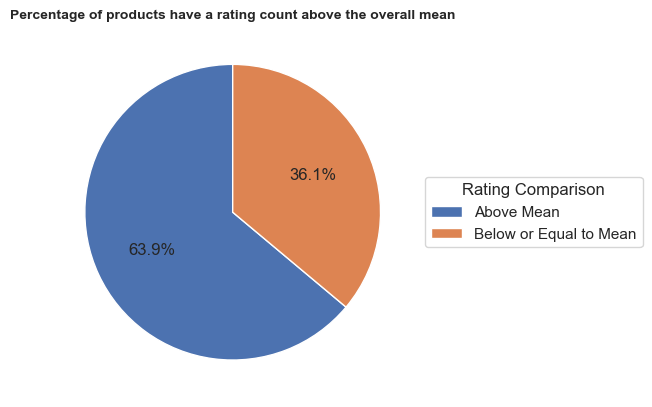


### Insights

The analysis shows that **63.9%** of products have an average rating **above** the overall mean rating.

* **Conclusion:** Most products receive better-than-average ratings, confirming high overall customer satisfaction.


## 6. Who are the **top reviewers** (users with the most reviews)?

The analysis focused on identifying the individuals who have submitted the highest number of product reviews. This required cleaning the reviewer names to group reviews accurately and then counting the contributions for each unique user.

The data was prepared by simplifying complex reviewer names into the `user_name_clean` field. The results were then tallied to find the total review count for each reviewer.

The findings clearly identify the most active reviewers:
* The top reviewer, **`$@|\|TO$|-|, Sethu madhav`**, leads the list with **10 reviews**.
* The next highest contributors, **`Manav, Adarsh gupta`** and **`Satheesh Kadiam, Pritom Chakraborty`**, each have **8 reviews**.

Overall, the analysis shows that a small group of highly active users, contributing between 7 and 10 reviews each, are responsible for a significant portion of the total customer feedback, primarily reviewing products such as **USBCables** and **Smartphones**.

View my notebook in details here:
[3_Customer_Review_Analysis.ipynb](1_Product_&_Price_Insights/3_Customer_Review_Analysis.ipynb)


### Visualize data

```
df_grouped= df.groupby('user_name_clean')[['user_id', 'category_clean']].value_counts().reset_index().sort_values(by='count', ascending=False).head(10).copy()
df_grouped.reset_index().drop(columns='index')
```

### Results

<div>
<style scoped>
    .dataframe tbody tr th:only-of-type {
        vertical-align: middle;
    }

    .dataframe tbody tr th {
        vertical-align: top;
    }

    .dataframe thead th {
        text-align: right;
    }
</style>
<table border="1" class="dataframe">
  <thead>
    <tr style="text-align: right;">
      <th></th>
      <th>user_name_clean</th>
      <th>user_id</th>
      <th>category_clean</th>
      <th>count</th>
    </tr>
  </thead>
  <tbody>
    <tr>
      <th>0</th>
      <td>$@|\|TO$|-|, Sethu madhav</td>
      <td>AHIKJUDTVJ4T6DV6IUGFYZ5LXMPA,AE55KTFVNXYFD5FPY...</td>
      <td>USBCables</td>
      <td>10</td>
    </tr>
    <tr>
      <th>1</th>
      <td>Manav, Adarsh gupta</td>
      <td>AG3D6O4STAQKAY2UVGEUV46KN35Q,AHMY5CWJMMK5BJRBB...</td>
      <td>USBCables</td>
      <td>8</td>
    </tr>
    <tr>
      <th>2</th>
      <td>Satheesh Kadiam, Pritom Chakraborty</td>
      <td>AGAELRYPMTG5SADZPDYB343EASAA,AGFN4JODOM2NTFCJQ...</td>
      <td>Smartphones</td>
      <td>8</td>
    </tr>
    <tr>
      <th>3</th>
      <td>Omkar dhale, JD</td>
      <td>AEWAZDZZJLQUYVOVGBEUKSLXHQ5A,AG5HTSFRRE6NL3M5S...</td>
      <td>USBCables</td>
      <td>7</td>
    </tr>
    <tr>
      <th>4</th>
      <td>ArdKn, Nirbhay kumar</td>
      <td>AECPFYFQVRUWC3KGNLJIOREFP5LQ,AGYYVPDD7YG7FYNBX...</td>
      <td>USBCables</td>
      <td>7</td>
    </tr>
    <tr>
      <th>5</th>
      <td>Prashant, Sumesh Sundararajan</td>
      <td>AG44HJB2AMIVHAGQZ2WGWONERKCA,AHL2FABQV6XAHZN54...</td>
      <td>MicroSD</td>
      <td>6</td>
    </tr>
    <tr>
      <th>6</th>
      <td>siddharth patnaik, Dr Sunilkumar H</td>
      <td>AHWRZWPCTG6ICA7WTNLNNZXWFI5Q,AF2AASVYVSROFD7FX...</td>
      <td>Smartphones</td>
      <td>6</td>
    </tr>
    <tr>
      <th>7</th>
      <td>Actual user, Shanti lal Gurjar</td>
      <td>AGU76WKSU62DUNTPCMTC4FCUNRTQ,AEOVR6JEQTAC77BXE...</td>
      <td>USBCables</td>
      <td>5</td>
    </tr>
    <tr>
      <th>8</th>
      <td>Manoj maddheshiya, Manoj Kumar Sahoo</td>
      <td>AHEVOQADJSSRX7DS325HSFLMP7VQ,AG7XYZRCSKX6G2OLO...</td>
      <td>SmartTelevisions</td>
      <td>5</td>
    </tr>
    <tr>
      <th>9</th>
      <td>Ayush, ROHIT A.</td>
      <td>AFSMISGEYDYIP3Z42UTQU4AKOYZQ,AF5ILQY4KFDTO5XHH...</td>
      <td>SmartTelevisions</td>
      <td>5</td>
    </tr>
  </tbody>
</table>
</div>


## 7. What are the **most frequent words** in review titles or review content?

The analysis focused on identifying the vocabulary most commonly used by customers in their reviews to understand the dominant topics and subjects of discussion. This involved processing the text from both review titles and content to determine word frequencies.

To prepare the text for analysis, the raw review content was cleaned by removing punctuation and converting all text to lowercase. The words from all reviews were then tokenized, combining them into a single list. Standard English **stop words** (such as 'the', 'a', 'is', 'and'), which carry little semantic value, were removed from this master list to ensure the frequency counts accurately reflected meaningful product-related terms.

Overall, the word frequency analysis confirms that reviews are highly focused on the **product's quality and functional usage**, providing a strong foundation for identifying key performance indicators and areas of customer interaction.

View my notebook in details here:
[3_Customer_Review_Analysis.ipynb](1_Product_&_Price_Insights/3_Customer_Review_Analysis.ipynb)


### Visualize data

```
sns.set_theme(style="whitegrid")
fig, ax = plt.subplots(2, 1)  # 2 rows, 1 column

# --- Positive words ---
sns.barplot(
    x='count',
    y='word',
    data=word_counts_df_g.sort_values(by='count', ascending=False).head(10),
    color='green',
    ax=ax[0]
)
ax[0].set_title('Top Positive Words', fontsize=16, weight='bold', color='green')
ax[0].set_xlabel('Frequency')
ax[0].set_ylabel('Word')
ax[0].set_xlim(0, 1500)

# --- Negative words ---
sns.barplot(
    x='count',
    y='word',
    data=word_counts_df_b.sort_values(by='count', ascending=False).head(10),
    color='red',
    ax=ax[1]
)
ax[1].set_title('Top Negative Words', fontsize=16, weight='bold', color='red')
ax[1].set_xlabel('Frequency')
ax[1].set_ylabel('Word')
ax[1].set_xlim(0, 1500)


sns.despine()
plt.tight_layout()
plt.show()
```

### Results
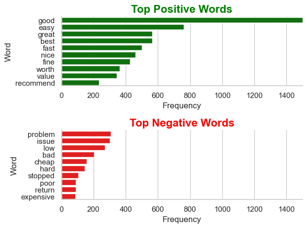


### Insights

Customer reviews show a highly dominant focus on positive attributes, led by words like **'good'** (1455 mentions), **'easy'** (760), **'great'** (565), and **'best'** (564). This indicates **strong overall satisfaction** and consistent praise for product **quality, performance, and user-friendliness**. Secondary positive terms like **'fast,' 'worth,'** and **'value'** confirm that customers recognize the products as being **efficient** and offering a solid **value proposition**.

**Negative Sentiment (Areas for Improvement)**

The most cited negative concerns are **'problem'** (308 mentions), **'issue'** (303), and **'low'** (271). This clearly establishes that the primary complaints are focused on specific **functional failures** or **quality control issues**, rather than general dissatisfaction. Other terms like **'stopped'** and **'hard'** relate to product longevity and difficulty of use.

**Executive Summary**

Overall customer sentiment is highly **positive**. While reviews frequently highlight successful product attributes, the negative feedback is specific and actionable, largely revolving around the need to address recurring **technical problems** and intermittent quality inconsistencies.


## 8. Is there a noticeable trend in **review ratings** vs. **review length** (longer reviews = higher/lower ratings)?

The analysis investigated the relationship between the **length of a customer review** (measured by word count) and the **star rating** assigned, seeking to determine if there is a tendency for longer reviews to correlate with either higher or lower ratings.

To perform this analysis, the word count for each review was calculated and then plotted against its corresponding rating in a scatter plot. A linear regression line was fitted to the data to visualize the overall trend, and the Pearson correlation coefficient was calculated to quantify the strength and direction of the relationship.

Overall, the visualization and statistics reveal a **statistically significant but practically irrelevant weak positive trend**. Longer reviews have a minimal tendency to be associated with slightly higher ratings, but the relationship is too weak to be considered a noticeable or reliable trend.

View my notebook in details here:
[3_Customer_Review_Analysis.ipynb](1_Product_&_Price_Insights/3_Customer_Review_Analysis.ipynb)


### Visualize data

```
from scipy.stats import pearsonr

r, p = pearsonr(df_plot['review_words_count'], df_plot['rating'])
print("Correlation coefficient:", r)
print("p-value:", p)

#----------------------------------------------------------------#

plt.figure(figsize=(7, 6))

sns.regplot(
    x='rating',
    y='review_words_count',
    data=df,
    scatter_kws={'alpha': 0.4, 's': 40, 'color': 'royalblue'},  # smaller, more transparent points
    line_kws={'color': 'red', 'linewidth': 2},  # highlight trend line
)

plt.title('Relationship Between Review Length and Rating', fontsize=14, weight='bold')
plt.xlabel('Rating', fontsize=12)
plt.ylabel('Review Word Count', fontsize=12)
plt.ylim(0, df['review_words_count'].quantile(0.98))  # cut extreme outliers for clarity
plt.grid(True, linestyle='--', alpha=0.6)
plt.show()
```


### Results

* *Correlation coefficient: 0.0691880513483714*
* *p-value: 0.008070425293893131*

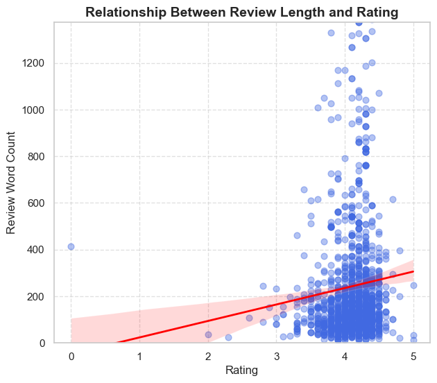


### Insights

The analysis examined the relationship between the **length of a review** (measured by word count) and the **rating** given by the customer, using a scatter plot and statistical measures (Pearson correlation and p-value).

**Key Findings and Interpretation**

The analysis yielded a **correlation coefficient ($r$) of 0.069**, which indicates a **very weak, positive correlation**. This means that while longer reviews *tend* to be associated with slightly higher ratings, the connection is marginal.

Crucially, the **p-value was 0.0082**, which is less than the standard significance level of 0.05. This confirms that the observed weak positive trend is **statistically significant** and not just due to random chance.

Visually, the scatter plot shows a high concentration of reviews with low word counts across all rating levels. Although the regression line slopes upward, the data points are highly dispersed, highlighting that **review length is not a strong practical predictor** of whether a review will be highly rated.

**In summary:** There is a statistically measurable, but extremely weak, positive link between the length of a review and its rating.


## 9. Is there a **significant difference** between the average **discounted price** and **actual price** across product categories?

The analysis sought to determine if the price difference (discount) is statistically significant at the level of product categories. This was achieved by applying a paired t-test to the aggregated mean actual prices and mean discounted prices across all categories.

* **Statistical Test:** Paired T-test on category means.
* **Result (p-value):** $3.05 \times 10^{-72}$ (Highly significant).

View my notebook in details here:
[1_Prices_Infrances.ipynb](2_Price_&_Discount_Relationships/1_Prices_Infrances.ipynb)


### Visualize data

```
from scipy.stats import ttest_rel

t, p = ttest_rel(df_sorted['actual_price'], df_sorted['discounted_price'])

print("t-statistic:", t)
print("p-value:", p)

#------------------------------------------------------------------------#

sns.set_theme(style="whitegrid")

sns.histplot(data=df_sorted, x='price_diff', bins=30, kde=True)
plt.xlim(0, 25000)
plt.title('Price Difference (Actual - Discounted)')
plt.xlabel('Price Difference')
plt.ylabel('Count')
plt.show()

```


### Results

* *t-statistic: 19.074171006227292*
* *p-value: 3.053503199093073e-72*

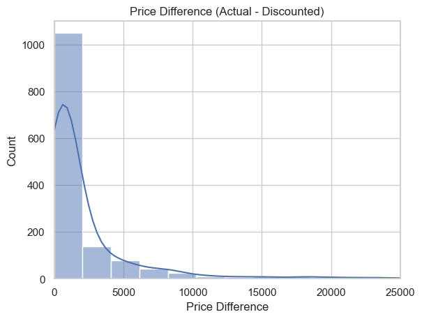


### Insights

**Discount Distribution**

The histogram shows a **highly right-skewed distribution** of price differences.

* **Observation:** Most products offer small to modest savings, creating a large peak near zero.
* **Implication:** A small number of high-value items receive extremely large discounts, creating a **long tail** up to \$25,000 in savings.

**Statistical Significance (Paired T-test)**

* **t-statistic:** 19.07
* **p-value:** $3.05 \times 10^{-72}$

* **Conclusion:** The **p-value is highly significant** (close to zero). This confirms that the average difference between the actual price and the discounted price is **statistically robust**, meaning the discounts offered are genuine and not random.

**Overall Summary:** Discounts are statistically proven to be effective, but the most significant savings are concentrated on a very few high-value products.


## 10. Does the **number of reviews (rating_count)** affect the **average rating**?

**Review Count vs. Rating Trend**

The analysis focused on determining the statistical relationship between a product's popularity (measured by the **number of reviews**) and its **average rating**.

The study used the Pearson correlation coefficient ($r$), which yielded a value of **$0.105$**. While the associated p-value ($0.0044$) confirmed this trend is **statistically significant**, the correlation itself is **very weak and positive**.  

View my notebook in details here:
[2_Number_of_reviews_Infrences.ipynb](2_Price_&_Discount_Relationships/2_Number_of_reviews_Infrences.ipynb)


### Visualize data

```
from scipy.stats import pearsonr

r, p = pearsonr(df_top15['rating_count'], df_top15['rating'])
print("Correlation coefficient:", r)
print("p-value:", p)

plt.figure(figsize=(8, 5))
sns.scatterplot(data=df_top15, x='rating_count', y='rating', hue='category_clean', alpha=0.7, palette='mako')
sns.regplot(data=df_top15, x='rating_count', y='rating', scatter=False, color='black', line_kws={'linewidth':2})
plt.title('Relationship between Rating_count and Rating')
plt.xlabel('Rating_count')
plt.ylabel('Rating')
plt.legend(title='Category', bbox_to_anchor=(1.05, 1), loc='upper left')
plt.tight_layout()
plt.show()
```


### Results

* **Correlation coefficient: 0.10454163231782487**
* **p-value: 0.00436239441164251**

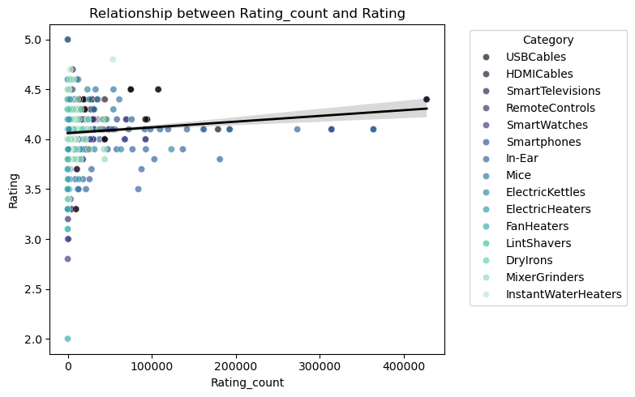


### Insights

This analysis assessed whether a product's popularity (high `rating_count`) affects its average star rating, using correlation and regression.

**key Finding**

The analysis resulted in a **very weak, positive correlation ($r = 0.105$)**. While statistically significant (p-value = 0.0044), this trend is practically minor.

**Conclusion**

There is a **statistically proven, but negligible, tendency** for products with a higher number of reviews to have a slightly higher average rating. The number of reviews is **not a meaningful determinant** of a product's final score.


## 11. Is there a **significant difference** in average **ratings** between **top 3 product categories**?

The analysis examined whether the top three product categories differ significantly in their average customer ratings. After selecting the categories with the highest representation in the dataset—**SmartWatches**, **Smartphones**, and **USBCables**—their rating data was grouped and compared statistically.

To test for overall differences among the three groups, a **one-way ANOVA** was performed. The results showed an **F-statistic of 9.909**, with a **p-value of 0.000064**, indicating that at least one category’s average rating is significantly different from the others.

To identify where the differences occur, a **Tukey HSD post-hoc test** was conducted. The comparison revealed that:

* **SmartWatches vs. USBCables** showed a statistically significant difference in mean ratings, with SmartWatches receiving higher ratings on average.
* **SmartWatches vs. Smartphones** and **Smartphones vs. USBCables** did not show statistically significant differences.

These results suggest that while overall variation exists among the top categories, the most meaningful difference is between **SmartWatches** and **USBCables**, where SmartWatches consistently achieve higher customer satisfaction.


View my notebook in details here:
[3_Average_Rating_Inferences.ipynb](2_Price_&_Discount_Relationships/3_Average_Rating_Inferences.ipynb)


### Visualize data

```
from scipy.stats import f_oneway

F, p = f_oneway(cat1, cat2, cat3)
print("F-statistic:", F)
print("p-value:", p )
print('')

import statsmodels.api as sm
from statsmodels.stats.multicomp import pairwise_tukeyhsd

tukey = pairwise_tukeyhsd(endog=df_top3['rating'],
                          groups=df_top3['category_clean'],
                          alpha=0.05)
print(tukey)


sns.set_theme(style="whitegrid")

plt.figure(figsize=(10, 6))

sns.pointplot(
    data=df_top3,
    x='category_clean',
    y='rating',
    capsize=0.15,
    errorbar='ci'
)

plt.title("Mean Ratings with 95% CI (Top 3 Categories)")
plt.xlabel("Category")
plt.ylabel("Average Rating")
plt.show()
```

### Results

**ANOVA Results**

* **F-statistic: 9.909111985063653**  
* **p-value: 6.415718751633342e-05**  

**Tukey HSD Multiple Comparison (FWER = 0.05)** 

| group1       | group2      | meandiff | p-adj  | lower    | upper    | reject |
|--------------|-------------|----------|--------|----------|----------|--------|
| SmartWatches | Smartphones | 0.0750   | 0.1054 | -0.0117  | 0.1617   | False  |
| SmartWatches | USBCables   | 0.1282   | 0.0000 | 0.0595   | 0.1970   | True   |
| Smartphones  | USBCables   | 0.0532   | 0.1889 | -0.0184  | 0.1249   | False  |

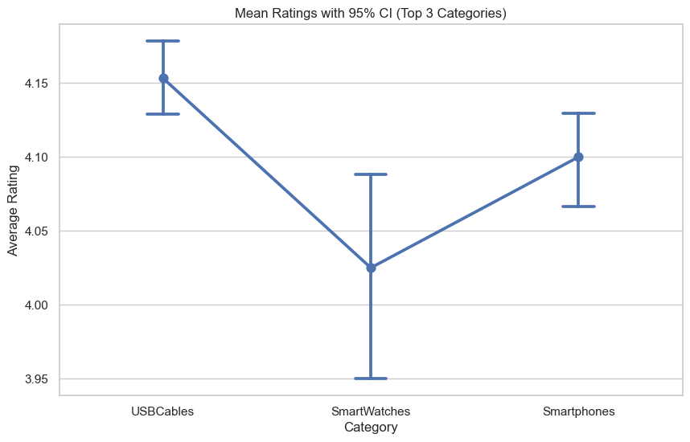


### Insights

The analysis confirms there **is a statistically significant difference** in average ratings among the top three product categories, driven specifically by the superior rating of **USBCables**.

**Statistical Proof (ANOVA and Tukey HSD)**

The analysis employed an **Analysis of Variance (ANOVA)** test and the **Tukey's Honestly Significant Difference (HSD)** post-hoc test to compare the mean customer ratings for **USBCables**, **SmartWatches**, and **Smartphones**.

* **ANOVA Result:** The p-value of $6.4 \times 10^{-05}$ is extremely low, leading to the **rejection of the null hypothesis**. This establishes that the mean ratings across the three categories are **not equal**.

* **Tukey HSD Results:** The pairwise comparison confirms the exact source of this difference:
    * **USBCables vs. SmartWatches:** The difference is **statistically significant** (p-adj = 0.0000). The mean rating for USBCables is higher than that for SmartWatches.
    * **Other Pairs:** The differences between Smartphones and USBCables (p-adj = 0.1889) and SmartWatches and Smartphones (p-adj = 0.1054) are **not statistically significant**. 
### Conclusion

The overall finding is that **USBCables receive significantly higher average customer ratings than SmartWatches**. While all three are top categories, customer approval is demonstrably stronger for the basic accessory (USBCables) compared to the more complex SmartWatches.


## 12. Which types of products generate **the best customer satisfaction** (high ratings and high discounts)?

The analysis focused on identifying product categories that represent the **ideal value proposition** for customers: those that achieve **High Ratings** (high customer satisfaction) while simultaneously being offered with **High Discounts** (high perceived value and attractiveness).

To execute this, the product data was segmented into groups based on predefined thresholds for both average rating and percentage discount. The thresholds used were: **High Rating** ($\ge 4.0$) and **High Discount** ($\ge 70\%$). The products fitting this criterion were isolated, and their category counts were aggregated to identify the dominant categories within this specific segment. The total number of products in this "High Rating & High Discount" segment was visualized using a stacked bar chart.

The visualization clearly shows that the **Cables** category leads this high-value segment with **48 products**. **Wearable Technology** follows closely behind with **34 products**. Other accessory-oriented categories such as **Mobile Accessories**, **Laptop Accessories**, and **Tablet Accessories** are also present but in much lower volumes. 

Overall, the analysis reveals that **simple electronic accessories**, primarily **Cables** and **Wearable Technology**, are the most successful products in delivering the combination of high customer satisfaction and aggressive pricing. These categories represent excellent "loss leaders" or highly competitive products that strongly appeal to value-conscious customers.

View my notebook in details here:
[1_Customer_Satisfaction_Analysis.ipynb](3_Business-Oriented_Questions/1_Customer_Satisfaction_Analysis.ipynb)

### Visualize data 

```
sns.set_theme(style="whitegrid", font_scale=1.1)

# --- Create subplots ---
fig, ax = plt.subplots(5, 1, figsize=(12, 12))

# --- Define color palette and data groups ---
plot_data = [
    (count_h_df, "High Rating & High Discount", "#4CAF50"),
    (count_hm_df, "(High Rating & mid Discount) or (mid Rating & high Discount)", "#C5FC00"),
    (count_m_df, "Mid Rating & Mid Discount", "#FFC107"),
    (count_lm_df, "(low Rating & mid Discount) or (mid Rating & low Discount)", "#FC6500"),
    (count_l_df, "Low Rating & Low Discount", "#F44336")
]

# --- Loop through each subplot ---
for i, (data, title, color) in enumerate(plot_data):
    sns.barplot(
        data=data,
        y='category_clean',
        x='count',
        color=color,
        ax=ax[i],
        edgecolor='black'
    )
    ax[i].set_xlim(0, 190)
    ax[i].set_title(title, fontsize=13, fontweight='bold', pad=10)
    ax[i].set_ylabel('Category' if i == 1 else '')  # keep center one only
    ax[i].set_xlabel('Number of Products' if i == 2 else '')
    ax[i].grid(axis='x', linestyle='--', alpha=0.5)

    for index, row in data.iterrows():
        ax[i].text(
            row['count'] + 1,     # x position (slightly to the right of bar)
            index,                # y position (row index)
            str(row['count']),    # text to display
            va='center'           # vertical alignment
        )

# --- Overall figure title ---
fig.suptitle("Product Category Distribution by Rating & Discount Level", 
             fontsize=16, fontweight='bold', y=1.02)

sns.despine()
plt.tight_layout()
plt.show()
```


### Results
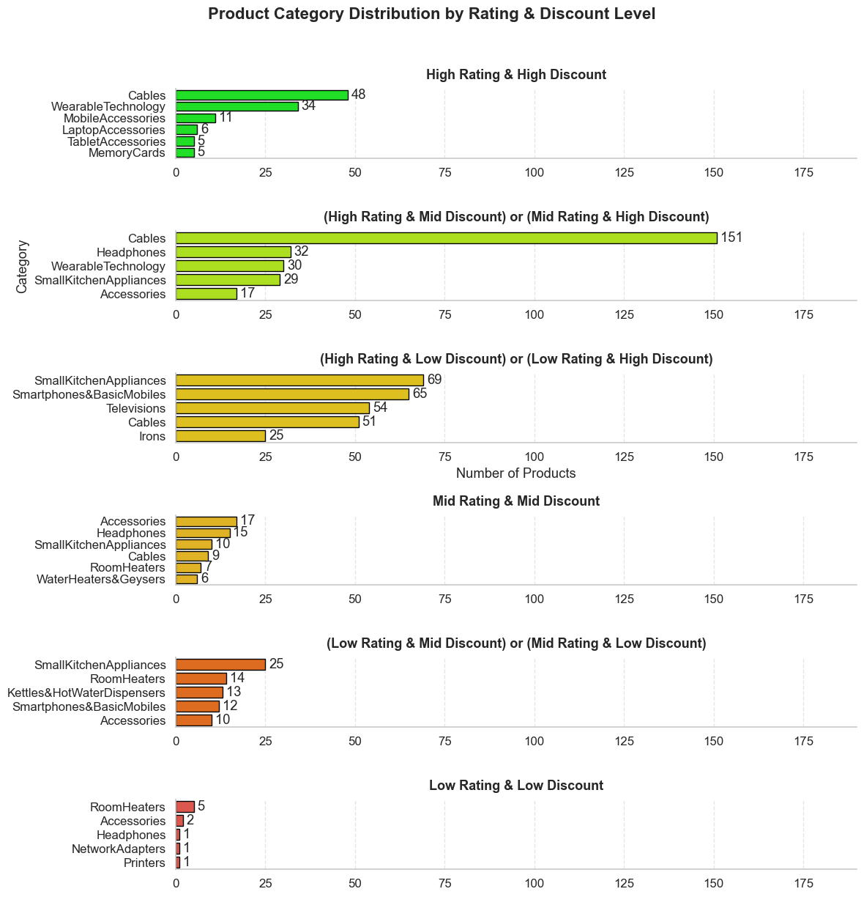


### Insights

The analysis segmented product categories by **Rating Level** (High, Mid, Low) and **Discount Level** (High, Mid, Low) to identify key market positions across five performance tiers.

**Definition of Rating and Discount Levels**

The assignment of categories was based on the following thresholds:

* **Discount Level Thresholds:** **High** is $\ge 70\%$, **Mid** is between $25\%$ and $70\%$, and **Low** is $< 25\%$.
* **Rating Level Thresholds:** **High** is $\ge 4.0$, **Mid** is between $3.5$ and $4.0$, and **Low** is $< 3.5$.

**Segment Insights**

* **High Performance Segments**
    * **High Rating & High Discount:** This is the **ideal value proposition**. Categories like **Cables** and **Wearable Technology** lead this group, achieving high customer satisfaction coupled with aggressive pricing.
    * **Mid/High Rating & Mid/High Discount:** This segment represents the highest **volume** of products. Categories like **Cables** and **Small Kitchen Appliances** offer good perceived value and drive significant transactions.

* **Mid-Range and Risk Segments**
    * **Mid Rating & Mid Discount:** Categories like **Small Kitchen Appliances** and **Accessories** fall here, representing an **average offer** with moderate satisfaction and pricing.
    * **Low Rating & Mid/Low Discount:** This is the **risk zone**. Categories such as **Accessories** and **Smartphones** have poor quality perception or insufficient discounts to motivate buyers, suggesting product quality may be weak despite fair pricing.

* **Low Performance Segment**
    * **Low Rating & Low Discount:** This is the **worst-performing segment**. Categories like **Printers** and **Vacuums** are weak in both customer satisfaction and pricing attractiveness, making them liabilities.


## 13. Are there specific **categories** where discounts have **no effect** on customer satisfaction?

The analysis examined whether discount percentages influence customer satisfaction (measured through product ratings) across different product categories. To assess this, an OLS regression model was used, incorporating interaction terms between each category and the discount percentage. These interaction coefficients reveal whether discounts significantly change ratings within each category.

After evaluating all interaction terms, the results show that **most product categories do not exhibit a statistically significant relationship** between discount levels and customer ratings. In other words, for many categories, customer satisfaction remains largely unchanged regardless of how much discount is offered.

Only a small number of categories (such as *Small Kitchen Appliances*) showed statistically significant negative effects, where larger discounts were associated with lower ratings — potentially indicating customer suspicion of quality or higher expectations after receiving a discount.

However, for the majority of categories — including **Smartphones**, **Wearable Technology**, **Cables**, **Laptop Accessories**, **Water Purifiers**, and **Room Heaters** — the interaction coefficients were **not statistically significant** (p > 0.05). This indicates that discounts in these categories **do not meaningfully impact customer satisfaction**, suggesting that customers rate these products based on intrinsic product quality rather than the size of the discount.

View my notebook in details here:
[2_Discount_&_Rate_Analysis.ipynb](3_Business-Oriented_Questions/2_Discount_&_Rate_Analysis.ipynb)


### Visualize data

```
import statsmodels.formula.api as smf

# Correct formula: rating ~ category + discount + category*discount
model = smf.ols('rating ~ C(category_clean) * discount_percentage', data=df_top15).fit()

print(model.summary())
```


### Results

**OLS Regression Results**

**R-squared:** 0.179
**Adjusted R-squared:** 0.155
**F-statistic:** 7.536
**Prob (F-statistic):** 1.63e-27
**No. Observations:** 1032


### Coefficients Table

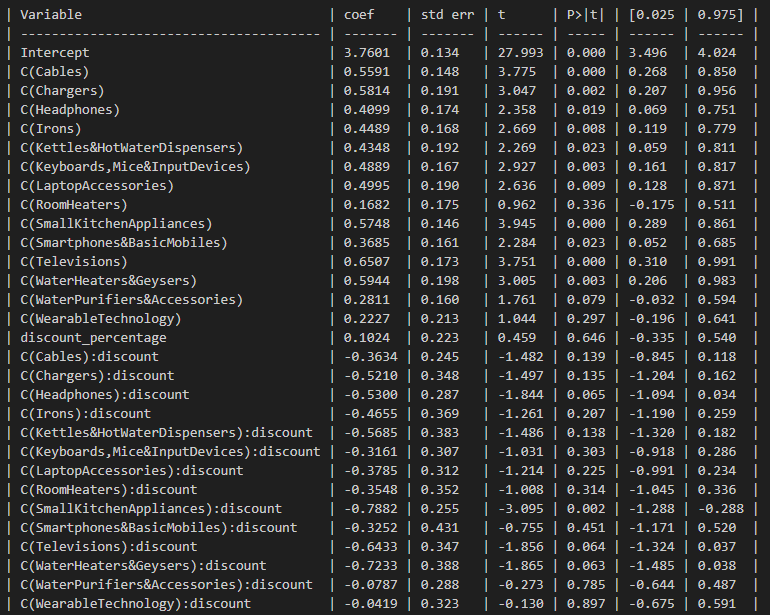

### Model Diagnostics

* **Durbin-Watson:** 2.059
* **Omnibus:** 270.186
* **Prob(Omnibus):** 0.000
* **Jarque-Bera:** 1551.316
* **Kurtosis:** 8.610


### Insights

The analysis used an OLS regression model with interaction terms between **product categories** and **discount percentages** to determine whether discounts influence customer satisfaction differently across categories. By examining the significance of each interaction coefficient, we can identify where discount levels do—or do not—affect product ratings.

The results show that **for most categories, discount percentage does *not* significantly impact customer satisfaction**. The interaction terms for categories such as **Cables, Chargers, Keyboards & Mice, Laptop Accessories, Room Heaters, Smartphones, Water Purifiers, and Wearable Technology** all have **p-values well above 0.05**, indicating that changes in discounts do not meaningfully change customer ratings in those categories.

Only a small number of categories show any sensitivity to discounts. For example, **Small Kitchen Appliances** exhibit a significant negative interaction (p = 0.002), meaning higher discounts are associated with *lower* ratings—suggesting customers may perceive high discounts as a signal of lower product quality. Categories like **Headphones**, **Televisions**, and **Water Heaters** display borderline significance (p ≈ 0.06), but still do not cross the 0.05 threshold.

Overall, the findings indicate that **discounts generally do not affect customer satisfaction across most product categories**, and shoppers tend to rate products similarly regardless of how heavily they are discounted. The few exceptions reflect potential quality perceptions rather than a universal trend.


## 14. Is there a **correlation** between **discount percentage** and **rating**?
## 15. Do **higher discounts** lead to **higher customer ratings**?

This analysis assessed the statistical relationship between the **discount percentage** offered on a product and its **average customer rating** using the Pearson correlation coefficient.

### Key Finding

* **Correlation Coefficient ($r$):** **-0.143**
* **P-value:** $3.79 \times 10^{-06}$

### Conclusions

1.  **Correlation:** There **is a statistically significant correlation** between discount percentage and rating.
2.  **Discount Impact (Answer to Q15):** **No, higher discounts do not lead to higher customer ratings.** The correlation is **inverse and very weak** ($r \approx -0.143$), suggesting a slight tendency for average ratings to **decrease** as the discount increases.
3.  **Practical Implication:** Discount percentage is **not a reliable predictor** of product satisfaction. The slight negative trend implies a marginal risk that the highest discounts may be associated with products facing slight quality or customer satisfaction issues.

View my notebook in details here:
[2_Discount_&_Rate_Analysis.ipynb](3_Business-Oriented_Questions/2_Discount_&_Rate_Analysis.ipynb)


### Visualize data

```
from scipy.stats import pearsonr

r, p = pearsonr(df_top15['discount_percentage'], df_top15['rating'])
print("Correlation coefficient:", r)
print("p-value:", p)

plt.figure(figsize=(8, 5))
sns.scatterplot(data=df_top15, x='discount_percentage', y='rating', hue='category_clean', alpha=0.7, palette='mako')
sns.regplot(data=df_top15, x='discount_percentage', y='rating', scatter=False, color='black', line_kws={'linewidth':2})
plt.title('Relationship between Discount Percentage and Rating')
plt.xlabel('Discount Percentage')
plt.ylabel('Rating')
plt.legend(title='Category', bbox_to_anchor=(1.05, 1), loc='upper left')
plt.tight_layout()
plt.show()
```


### Results

* **Correlation coefficient: -0.1433272669450551**
* **p-value: 3.788508461971801e-06**

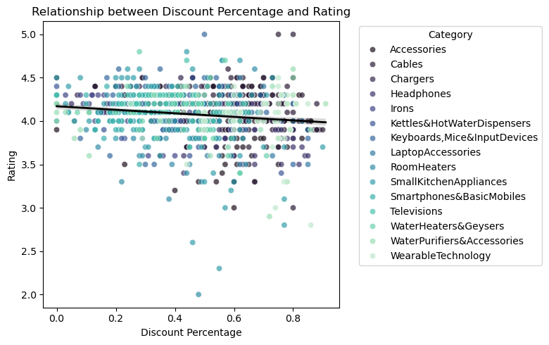


### Insights

This analysis assessed the statistical relationship between the **discount percentage** offered on a product and its **average customer rating** using the Pearson correlation.

**Key Finding**

* **Correlation Coefficient ($r$):** **-0.143**
* **P-value:** $3.79 \times 10^{-06}$

### Conclusion

The analysis reveals a **statistically significant, but very weak, inverse (negative) correlation**. This implies that as the discount percentage **increases**, the average rating has a slight tendency to **decrease**.

The practical implication is that **discount percentage is not a reliable predictor** of product satisfaction, though the slight negative trend suggests a marginal risk that the highest discounts may be associated with products facing slight quality or customer satisfaction issues.


# What I Learned

Throughout this project, I gained a deep understanding of **product analytics**, **customer behavior**, and **data visualization techniques**. The key skills and insights I developed include:

### **1. Data Cleaning & Preparation**

* Learned how to merge and clean datasets from multiple sources.
* Standardized category names, reviewer names, and missing data.
* Extracted meaningful numerical features such as rating distributions and review counts.

### **2. Exploratory Data Analysis (EDA)**

* Conducted in-depth statistical analysis using **mean**, **median**, **quartiles**, and distribution plots.
* Identified rating patterns and discovered that customer ratings are highly concentrated between **4.0 and 4.3 stars**.

### **3. Data Visualization**

* Built clear and informative visualizations using **Matplotlib**, **Seaborn**, and **Pandas**.
* Created histograms, KDE curves, boxplots, pie charts, and bar charts.
* Enhanced charts with labeled percentiles, annotations, and meaningful titles.

### **4. Sentiment & Text Analysis**

* Processed review text by tokenizing, cleaning, and removing stopwords.
* Extracted the most frequent **positive** and **negative** words.
* Learned how customer sentiment aligns with product performance.

### **5. Customer Insights & Behavioral Patterns**

* Identified the **top reviewers** and the categories they contribute to most.
* Discovered that **63.9% of products** receive a rating above the global mean.
* Understood how review frequency and rating distribution reflect customer satisfaction.

### **6. Report Writing & Storytelling with Data**

* Improved my ability to explain findings clearly.
* Structured insights into a logical, easy-to-read narrative.
* Converted raw analysis into actionable conclusions.


# Challenges I Faced

Throughout the project, I encountered several technical and analytical challenges that helped me improve my skills and deepen my understanding of real-world data work.

### **1. Cleaning and Standardizing the Data**

* The dataset contained inconsistent **reviewer names**, duplicated entries, and mixed formatting.
* Some fields required manual logic to correctly merge or simplify user names.
* Dealing with missing values and irregular text formats required careful preprocessing.

### **2. Handling Large and Noisy Text Data**

* Review content varied greatly in length and clarity.
* Cleaning text (removing punctuation, stopwords, and noise) took significant effort.
* Extracting meaningful words while avoiding common filler terms required multiple iterations.

### **3. Visualizing Complex Insights**

* Combining a histogram, KDE curve, and boxplot in a clear way required testing several layout options.
* Ensuring that the visuals communicated the exact story (like showing quartiles and mean values) needed multiple refinements.

### **4. Grouping Reviewers Accurately**

* Many reviewers had multiple identifiers or variations of their names.
* Creating the `user_name_clean` field to correctly group them was challenging but essential.

### **5. Sentiment Interpretation**

* Separating **positive** and **negative** words from thousands of tokens was not straightforward.
* Some words could be either positive or negative depending on context, requiring careful filtering.

### **6. Maintaining Notebook Organization**

* The analysis consisted of multiple stages (ratings, reviews, text processing).
* Keeping the notebook structured and readable required consistent documentation and commenting.


# Conclusion

This project provided a comprehensive exploration of product ratings, customer reviews, and user behavior across multiple categories. Through detailed statistical analysis, text processing, and visualization, the findings highlight strong overall customer satisfaction, with ratings tightly concentrated around 4.0–4.3 stars. A majority of products perform above the average rating, demonstrating consistent quality across the catalog.

The analysis also revealed valuable insights into customer sentiment: positive feedback overwhelmingly focuses on product quality, usability, and value, while negative comments are more specific, often relating to isolated technical issues or durability concerns. Identifying the most active reviewers and the most frequently used words further helped uncover key behavior patterns and product usage themes.

Overall, the project strengthened essential data skills—including cleaning, visualization, statistical analysis, and natural language processing—while producing actionable insights that can support product evaluation, customer experience improvements, and business decision-making.
